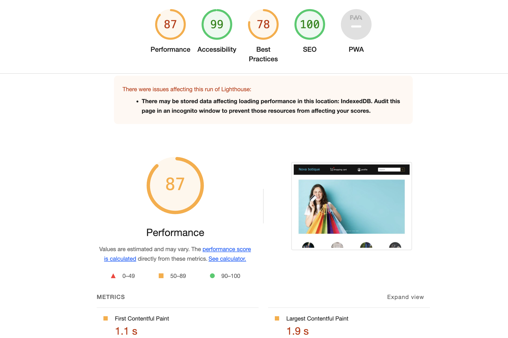

# Welcome to Nava Boutique Online Shop

Discover the world of fashion at Nava Boutique, where style meets convenience. Our user-friendly platform offers a seamless and enjoyable shopping experience for clothing and accessories enthusiasts. Whether you're planning a wardrobe refresh or looking for the perfect accessory, Nava Boutique has you covered.

We value your feedback and strive to enhance your shopping experience. If you have any questions or suggestions, feel free to reach out to our customer support team.

Happy shopping at Nava Boutique Online Shop!


## Visit the Live Site

Experience the Nava Boutique magic by visiting our live site deployed on Heroku. Click [here](https://nova-shop-ea4ad33fa8c5.herokuapp.com/) to explore the latest trends and shop with ease.

## Features

- **Responsive Design**: Our website is fully responsive, ensuring a smooth and enjoyable shopping experience across various devices, from desktops to smartphones.

- **Built with Django**: Nava Boutique is powered by the Django framework in Python, providing a robust and secure foundation for our platform.

## Table of Contents

- [Live Site](https://nova-shop-ea4ad33fa8c5.herokuapp.com/)
- [Overview](#overview)
- [Key Features](#key-features)
- [User Experience (UX)](#user-experience-ux)
  - [User Stories](#user-stories)
- [Features](#features)
- [Product Catalog](#product-catalog)
- [Design](#design)
- [About Us](#about-us)
- [Forms](#forms)
- [Custom 404 Error](#custom-404-error)
- [Custom Models](#custom-models)
- [Other Features](#other-features)
- [Deployment](#deployment)
- [Testing](#testing)
- [Screenshots](#screenshots)
- [Deployment](#deployment)

  - [Github](#github)
  - [Django](#django)
  - [Heroku](#heroku)
  - [AWS](#clone)
  - [Stripe](#Stripe)
  - [Languages](#languages)
  - [Libraries, Frameworks & Tools](#libraries-frameworks-and-tools)

## Overview

Nava Boutique Online Shop is a fashion-forward platform built on the Django framework using Python. With a robust and secure foundation, our site offers a user-friendly interface, making online shopping a delightful experience.

## Key Features

- **Product Catalog**: Explore our extensive product catalog featuring the latest fashion trends, from clothing to accessories.
- **Secure Online Shopping**: Enjoy secure online shopping with user-friendly features for account management, order placement, and tracking.
- **Responsive Design**: Access the site seamlessly on desktops, tablets, and mobile devices.
- **User-Friendly Interface**: Navigate through our platform effortlessly, ensuring a hassle-free shopping process.

## User Experience (UX)

### User Stories

- #### Navigation

  - As a user, I want to navigate around the site easily to locate the products I want.
  - As a user, I want to view a list of all available products.
  - As a user, I want to be able to view more details on a product, such as price, ingredients, and reviews.
  - As a user, I want to be able to refine my search with categories.
  - As a user, I want to be able to sort products by price, review, or name.
  - As a user, I want to be able to easily contact the site owner if needed.
  - As a user, I want to be able to see all ingredients contained within the product, including any allergens.

- #### Accounts

  - As a user, I want the option to register for an account, allowing me to save my details and see previous orders.
  - As a user, I want to receive confirmation emails to confirm my registration.
  - As a user, I want the ability to be able to log in and out and be able to easily work out my current login status.
  - As a user, I want to be able to recover my account information in the event that I forget it.


- #### Admin

  - As an admin, I want to be able to add products easily in a format consistent with the rest of the site.
  - As an admin, I want to be able to edit products easily to ensure the customer is being shown the most up-to-date information
  - As an admin, I want to be able to delete discontinued products or mark seasonal products out of stock when not available.
  - As an admin, I want to be able to easily manage the images in the gallery, and update the site policies.
  - As an admin, I want to be able to add and update the ingredients for products and mark any allergens appropriately.

- #### Purchasing

  - As a user, I want to be able to add items to my cart, allowing me to store things until I'm ready to complete my purchase.
  - As a user, I want to be able to view my cart so I can see the current running total of my potential purchases.
  - As a user, I want the ability to update the quantity of the items in my cart easily.
  - As a user, I want an easily viewable total to allow me to monitor my overall spending.
  - As a user, I want to be able to complete the purchasing journey, without the need to register if I do not wish to.
  - As a user, I want to receive confirmation of my order so I know my order was placed successfully.
  - As a user, I want to be able to view my order history so I can review past purchases.

- #### Interaction

  - As a user, I want to be able to leave a review of products to share my experience with other customers
  - As a user, I want to be able to easily connect to the business's social media pages to keep up to date.
  - As a user, I want to be able to easily contact the site owner if needed.

#
## Design

- ### Colours

  The decision was made to keep the colors as simple as possible for the website, with the main content being either black text on a white background, or vice versa.

  This is due to cakes and confectionary being inherently colorful. Reducing the color palette to the most basic possible helps draw attention to the products displayed, and the colors within.

  

- ### Fonts

  The [Verdana](https://www.cufonfonts.com/font/verdana) font from Google Fonts is used throughout the site on all content.

  This font was chosen due to its readability, popularity, and familiarity, with it being the chosen font for some products produced by Google.


- ### Wireframes

- ### Database Schema

  The database schema for the project was:

  

  The full image can be viewed [here](img/schema.png)

#
## Features

### User Authentication and Account Management

- Registration, login, and password reset functionalities.
- User-friendly forms for signup, login, password reset, and order placement.

### Shopping Cart

- Add products to the shopping cart.
- Manage the shopping cart by updating quantities and removing items.
- Checkout and place orders with order history tracking for users.

### Admin Dashboard

- Admin dashboard for managing products, orders, and users.
- Admin approval required for new product listings before they appear on the main page.

### User Comments

- Users can leave comments on products.
- Admin can review and approve comments before displaying them on the main page.

### Custom Models

- Users can create and manage their orders, adding, removing, or editing their selections.
- Users can leave comments and like products in the catalog.
- Users can track the status of their orders.

### Product Catalog

- A curated product catalog showcasing the latest fashion trends.
- Each product includes detailed descriptions, size options, and high-quality images.
- Dynamic filtering options to help users easily find desired products.

### Design

The Nava Boutique Online Shop follows a clean and intuitive design:

- **Color Scheme**: Utilizes a modern and inviting color palette to enhance the visual appeal.
- **Typography**: Employs easy-to-read fonts for a comfortable browsing experience.
- **Responsive Layout**: Adapts seamlessly to different screen sizes, ensuring accessibility across devices.
- **Intuitive Navigation**: Provides clear and logical navigation paths for a user-friendly experience.

### About Us

At Nava Boutique Online Shop, we are passionate about delivering a delightful shopping experience. Our team is dedicated to providing you with a seamless and user-friendly platform to make your online shopping hassle-free. We believe in the joy of discovering new fashion trends and creating your unique style. Thank you for choosing us for your fashion needs.

### Forms

Users can leave comments, sign up, log in, reset passwords, and make orders with forms. They can also access their order information in the shopping cart or user panel.

### Custom 404 Error

  - Error 404 Page

    If the user navigates to a page that does not exist, the 404.html page will render. This page has the same basic layout as the home page of the site, but displays different text content. The button, however, still returns the user to the main products page.

    

### Custom Models

1. Users can create and manage their orders, adding, removing, or editing their selections.
2. Users can leave comments and like products in the catalog.
3. Users can track the status of their orders.

### Other Features

- Social media marketing through platforms like Facebook and Instagram to reach and engage with the target audience.
- Influencer collaborations and partnerships to increase brand visibility and generate sales.
- The HTML templates include descriptive meta tags that enhance search engine visibility and provide meaningful information about the website's pages.
- Search engine optimization (SEO) techniques to improve organic visibility and attract potential customers.

### Deployment

I deployed this website using GitPod, Heroku, and following the below steps:

1. Log in to GitHub.
2. Log in to Heroku.
3. Use GitPod to deploy and commit changes to GitHub.
4. Add Procfile and Gunicorn for running code on Heroku.

### Testing

- Comprehensive testing using the Django test framework.
- Users must log in first to access all features of the site.

## Screenshots

### 1. Add Products

**Description:** This screenshot showcases the "Add Products" interface, where administrators can add new food items to the menu.

### 2. Comments Section

**Description:** Users can leave comments on food items, fostering user interaction. Admins have the ability to review and approve comments before they appear on the main page, ensuring content quality.

### 3. Header Section

**Description:** The header is a crucial component of the website, offering clear and intuitive navigation. It typically includes the restaurant's logo, navigation links, and may feature a search bar or other relevant elements.

### 4. Login Page

**Description:** Users access their accounts securely through the login page. This is essential for user authentication, enabling registered users to manage reservations, orders, and preferences.

### 5. Teller

**Description:** The Teller section allows users to subscribe to email notifications for new arrivals. Users can enter their email address to receive updates about the latest additions to the menu.

### 6. Admin Section - Add Products

**Description:** Admins have the ability to add new products to the menu through a dedicated interface, ensuring seamless management of the restaurant's offerings.

### 7. Admin Section - Change Password

**Description:** Admins can change their password securely through a designated page, enhancing account security and access control.

### 8. Admin Section - Accept Comments and Edit Users

**Description:** Admins can review and accept comments from users, ensuring content quality. Additionally, they have the capability to edit user profiles, providing comprehensive control over user management.

### 9. Checkout Section

**Description:** The Checkout section allows users to review their selected items, enter shipping information, and proceed to payment. This step-by-step process ensures a smooth and secure completion of the order.

### 10. Order Details and Receipt

**Description:** After completing the checkout process, users receive a detailed order summary and a receipt. This includes information about the items purchased, total cost, and any relevant order details. Enhances user experience by providing a clear record of their transaction.

## Databases (PostgreSQL)

### Database Structure
* The project uses PostgreSQL as the relational database management system.
* Schemas and tables are organized to store information about products, users, comments, and orders.

### Database Connection
* The application connects to the PostgreSQL database to retrieve and store data.
* Database connection details such as host, port, username, and password are configured in the application's settings.

### Database Interaction
* CRUD operations are implemented to interact with the database.
* SQL queries are used to insert, retrieve, update, and delete data based on user actions and system requirements.

### Data Security
* The application ensures data security by using parameterized queries and prepared statements to prevent SQL injection attacks.
* Passwords are securely hashed before storing them in the database to enhance user authentication security.

#

## Testing

All parts of views and forms were tested using the inner framework of Django test. Users must log in first to use all features of the site.

### HTML

- HTML validation was carried out using the [Nu HTML Checker tool](https://validator.w3.org/) by W3C.
- Links are provided where the page could be tested using the URL.

#

- #### Home Page Validation

  - [Link](https://validator.w3.org/nu/?doc=https%3A%2F%2Fnova-shop-ea4ad33fa8c5.herokuapp.com)

  

...

### Lighthouse

- Lighthouse, using Chrome Dev Tools, was used to ensure best practices were followed on the site.

  


## Deployment

- ### Github

  - Before you start, a repository (repo) is required on Github which can be created in a number of ways.

    - #### Create A New Repo

      1. Log into Github.
      2. In the top left corner of the page is a column titled 'Recent
         Repositories' Click the button labelled 'New'.
      3. Name the repository and click 'Create repository'.
      4. Your new repository is now set up and ready to use.

    - #### Forking

      Creating a forked repo creates a copy of a repo within
      github account.

      How to Fork A Repository:

      1. Sign in to Github and go to the required repo.
      2. Locate the Fork button at the top right of the page.
      3. Click the button then click 'Create Fork'.
      4. You have now successfully forked the repo.

    - #### Clone

      Cloning a repo creates a copy of a repo on your
      local machine.

      How to Clone A Repository;

      1. Sign in to Github and go to the required repo.
      2. At the top of the page, above the files, is a button labelled
         'Code'
      3. Select the required option from HTTPS, SSH or Github CLI, then click the clipboard icon to copy the URL.
      4. Open git bash
      5. Type 'git clone' and then paste the copied URL. Press Enter.

- ### Django

  This project is built on the Django framework.

  Django can be installed by following the steps below:

  1. In your chosen IDE type the command:  
     `pip3 install django`
  2. To create an name your project use the command:  
     `django-admin startproject <your_project_name> .`
  3. A gitignore file is an important addition as you can specify
     which files should not be uploaded to the Github repo, such as
     database credentials.

     A gitignore file can be created in the CLI using the command:

     `touch .gitignore`

     The .gitignore file for this project can be found [here](.gitignore)

  4. To check django has been installed and your project created successfully, type the following command:

     `python3 manage.py runserver`

     Following the link provided in the CLI should display the Django landing page.

  5. Next, initial database migrations need to be completed. This can be achieved with the command:

     `python3 manage.py migrate`

     You can see the changes to be made without executing them with the command:

     `python3 manage.py migrate --plan`

  6. In order to have access to the admin panel, a superuser is required. This is created with the command:

     `python3 manage.py createsuperuser`

     This will then ask you to create a username and password with an optional email address.

  7. Once these steps are completed you can push your changes to Github using the commands below in order, or with the interface in your chosen IDE:

     ```
     git add .
     git commit -m "initial commit"
     git push
     ```


### Heroku

Heroku is the chosen cloud platform for the project, allowing the project to be built and deployed via a link to the Github Repo.

1. Once you are logged in to Heroku, click the 'New' button in the top right corner of the page and select 'Create new app'.
2. Select a name for your app (which must be unique!), select the closest region to you and click 'Create App'.
3. Once the app has been created, select the resources tab, navigate to the 'Add-ons' section and search for 'Heroku Postgres'.
4. Select 'Heroku Postgres', then under 'Plan name' choose 'Hobby Dev - Free' and click 'Submit Order Form'.

To use Postgres with Django, additional tools are required, and can be installed via the CLI in your chose IDE.

1.  In your CLI type the command:  
    `pip3 install dj_database_url`
2.  Once completed, enter the following command into the CLI:  
    `pip3 install psycopg2-binary`
3.  At the top of the settings.py file in your main project folder, and the line:
    ```
    import dj_database_url
    ```
4.  Scroll down in settings.py to the `DATABASES` section. Replace the code in this section with the code below.

    ```
    DATABASES = {
        'default': dj_database_url.parse(<DATABASE_URL_GOES_HERE>)
    }
    ```

    The Postgres Database URL can be found in the settings tab of your app in Heroku, under the Config Vars section.

5.  As we are now connected to a new database, we need to repeat the previous migration steps. This is done by running the command:  
    `python3 manage.py migrate`

6.  We also need to create a new superuser with the command :  
    `python3 manage.py createsuperuser`

7.  Before we commit these changes, we will need to alter the `DATABASES` section in settings.py to prevent the Postgres Database URL ending up in version control.

8.  This can be achieved by replacing the existing content of the `DATABASES` section with the code below.

    ```
    if 'DATABASE_URL' in os.environ:
        DATABASES = {
            'default': dj_database_url.parse(os.environ.get('DATABASE_URL'))
        }
    else:
        DATABASES = {
            'default': {
                'ENGINE': 'django.db.backends.sqlite3',
                'NAME': BASE_DIR / 'db.sqlite3',
            }
    }
    ```

9.  Gunicorn needs to be installed next, which acts as our web server. This is done with the command:

    `pip3 install gunicorn`

10. We also need to create a `Procfile` to tell Heroku to create a web dyno. In the root directory of your app, create a file named `Procfile` and inside insert the code:

    `web: gunicorn PROJECT_NAME_HERE.wsgi:application`

11. In Heroku, we need to prevent the collection of static files until we have set up AWS. This is achieved by navigating to the Settings tab in Heroku, selecting the Config_Vars section and entering `DISABLE_COLLECTSTATIC` in the `KEY` field, and `1` in the `VALUE` field and clicking the 'Add' button.

    When the site is deployed at this stage, no static files will be present, but this will be rectified later.

12. In order to allow your project to be viewed when deployed to Heroku, we need to add the Project URL to the `ALLOWED_HOSTS` section of settings.py
    ```
    ALLOWED_HOSTS = ['PROJECT_NAME_HERE.herokuapp.com', 'localhost', '127.0.0.1']
    ```
13. The changes can now be committed and pushed to Github. Once this has been done, we can push the changes to Heroku with the command:

        `git push heroku main'


### AWS

Amazon's AWS platform us used to store all static and media files.

#### S3

1. An AWS account is required which can be created [here](https://aws.amazon.com/).
2. Once you have created an account and logged in, select the `Services` button in the top left corner of the page, scroll to the bottom and select `Storage` followed by `S3`.
3. Once on the S3 page we can create a new bucket by clicking the orange `Create bucket` button on the right side of the page.
4. Provide a name for the bucket and select the closest region to you.
5. Under `Object Ownership` select `ACLs enabled` and leave the Object Ownership as `Bucket owner preferred`.
6. Uncheck `Block all public access` checkbox and check the warning box to acknowledge that the bucket will be made public, then click `Create bucket` at the bottom of the page.
7. Once created, click your bucket's name and navigate to the `Properties` tab. Scroll to the bottom and under `Static website hosting` click the `Edit` button. Change the `Static website hosting` option to `Enable`. Type `index.html` into the `Index document` field. You can then scroll to the bottom of the page and click `Save Changes`.
8. Navigate to the `Permissions` tab, Scroll to the `Cross-origin resource sharing (CORS)` section, click the `Edit` button and paste in the following code:
   ```
   [
       {
           "AllowedHeaders": [
           "Authorization"
           ],
           "AllowedMethods": [
           "GET"
           ],
           "AllowedOrigins": [
           "*"
           ],
           "ExposeHeaders": []
       }
   ]
   ```
9. Scroll up to the `Bucket Policy` section. Click the `Edit` button and then `Policy generator`.
10. Select `S3 Bucket Policy` in the 'Select Type of Policy' dropdown menu. Inside the `Principal` field type `\*` to allow all principals.
11. Select `GetObject` from the `Actions` dropdown menu.
12. Head back to the previous tab and navigate to the `Properties` tab. Copy the value from the `Amazon Resource Name (ARN)` field, return to the `Policy Generator` tab and paste the value into the `Amazon Resource Name (ARN)` field .
13. Once this has been completed, click `Add statement`, then `Generate Policy`. Copy the generated policy and paste it into the `Bucket policy` editor.
14. Before saving, add a `/*` at the end of your resource key. This is to allow access to all resources in this bucket.
15. Next, scroll down to the `Access control list (ACL)` section and click the `Edit` button.
16. Next to `Everyone (public access)`, check the `List` checkbox. This will generate a warning which must be acknowledged. Once this is done click `Save changes`.

#### IAM (Identity and Access Management)

1. Now that the bucket has been created, we need to create a user to access it. In the search bar at the top of the page, type `IAM` and select it.
2. Once on the `IAM` page, click `User Groups` from the side bar on the left of the page, followed by `Create group` in the top right of the next page.
3. To make managing mulitple projects in the future a little easier, it's best to name your user group something like `manage-_your-project-name_`. Once you've selected a name, click `Create group` at the bottom of the page.
4. From the side bar on the left of the page, click `Policies`, then `Create policy`.
5. Select the `JSON` tab and click `Import managed policy`. Search for `S3` and select `AmazonS3FullAccess`. Click import.
6. Once imported this will need to be edited slightly. Return to your bucket and copy your ARN number. Back on the `Create polioy` page, update the Resource key to include your ARN, and another line with your ARN followed by a `/*`. It should look like the code below:
   ```
   {
       "Version": "2012-10-17",
       "Statement": [
           {
               "Effect": "Allow",
               "Action": [
                   "s3:*",
                   "s3-object-lambda:*"
               ],
               "Resource": [
                   "YOUR-ARN-HERE",
                   "YOUR-ARN-HERE/*"
               ]
           }
       ]
   }
   ```
7. Click the `Next: Tags` button, click the `Next: Review` button. Enter your policy name into the `Name` field andclick `Create policy`.
8. Click on `User groups` in the side bar on the left of the page, and click the earlier created group. Go to the `Permissions` tab and click `Add permission` and select `Attach policies`.
9. Find the newly created policy, select it and click `Add permissions`.
10. Finally, we need to create a user. Select `Users` from the side bar on the left of the page and click `Add users`.
11. Give your user name related to your project, such as `project-name-static-user`, check `Access key - Programmatic access`, and click `Next: Permissions`.
12. Select your previously created group with the required policy attached and click `Next: Tags`, `Next: Review`, then `Create user`.
13. On the next page, download the CSV file. This contains the user's access key and secret access key which you will need later.


#### Connecting AWS to Django

Now that AWS has been fully configured for our needs, we need to connect Django to AWS.

1. Firstly, we will need to install two packages. `Boto3` and `django-storages`, which can be done with the following commands:
   ```
   pip3 install boto3
   pip3 install django-storages
   ```
2. Add `storages` to the `INSTALLED_APPS` section of settings.py.
3. We also need to add some additional settings to let Django know which AWS bucket it will be communicating with.
4. At the bottom of settings.py add the following code:
   ```
   if 'USE_AWS' in os.environ:
       AWS_STORAGE_BUCKET_NAME = 'your-bucket-name-here'
       AWS_S3_REGION_NAME = 'insert-your-region-here'
       AWS_ACCESS_KEY_ID = os.environ.get('AWS_ACCESS_KEY_ID')
       AWS_SECRET_ACCESS_KEY = os.environ.get('AWS_SECRET_ACCESS_KEY')
   ```
5. We now need to return to Heroku. In the `Settings` tab, under `Config Vars`, we need to add the values from the CSV file we downloaded earlier.
6. Add the key `AWS_ACCESS_KEY_ID` with the value that was generated in the CSV file. Add the key `AWS_SECRET_ACCESS_KEY`, and add the value that was generated in the CSV file. Add the key `USE_AWS` and set the value to True.
7. We can now also remove the DISABLE_COLLECTSTAIC variable, as we now want static files to be collected and uploaded to AWS.
8. Return to the settings.py file and add the following code to the `USE_AWS` if statement created earlier:
   ```
   AWS_S3_CUSTOM_DOMAIN = f'{AWS_STORAGE_BUCKET_NAME}.s3.amazonaws.com'
   ```
9. We need to create a file to tell Django that we want to use S3 to store our static files. In the root directory of your project, create a file called `custom_storages.py`. Inside this file add the following code:
   ```
   from django.conf import settings
   from storages.backends.s3boto3 import S3Boto3Storage
   ```
10. Underneath the imports insert these two classes:

    ```
    class StaticStorage(S3Boto3Storage):
        location = settings.STATICFILES_LOCATION


    class MediaStorage(S3Boto3Storage):
        location = settings.MEDIAFILES_LOCATION
    ```

11. In settings.py, underneath the bucket config settings but still inside the if statement, add these lines:
    ```
    STATICFILES_STORAGE = 'custom_storages.StaticStorage'
    STATICFILES_LOCATION = 'static'
    DEFAULT_FILE_STORAGE = 'custom_storages.MediaStorage'
    MEDIAFILES_LOCATION = 'media'
    ```
12. Next, you will also need to override and explicitly set the URLs for static and media files using your custom domain and new locations. To do this add these two lines inside the same if statement:
    ```
    STATIC_URL = f'https://{AWS_S3_CUSTOM_DOMAIN}/{STATICFILES_LOCATION}/'
    MEDIA_URL = f'https://{AWS_S3_CUSTOM_DOMAIN}/{MEDIAFILES_LOCATION}/'
    ```
13. We can now save, add, commit and push the changes and files will b e added to the AWS S3 bucket. Inside the if statement add the code below which lets the browser know it can cache static files:
    `AWS_S3_OBJECT_PARAMETERS = { 'Expires': 'Thu, 31 Dec 2099 20:00:00 GMT', 'CacheControl': 'max-age=94608000', }`
    14.In `S3` on `AWS`, go to your project bucket and click `Create folder`. Name the folder `media` and click `Save`.

14. Inside the media folder, click `Upload`, `Add files`, and then select all media files used in your project.
15. Under `Permissions`, select `Grant public-read access` and click `Upload`. You will need to acknowledge the displayed warning before you can do this.


### Stripe

Stripe is used to handle the checkout process when a payment is made. A Stripe account is needed. You can sign up [here](https://stripe.com/en-gb).

#### Payments

1. To set up Stripe payments you can follow the guide available [here](https://stripe.com/docs/payments/accept-a-payment#web-collect-card-details).

#### Webhooks

1. To set up a webhook, sign into your Stripe account and click `Developers` located in the top right of the navbar.
2. In the side bar on the left of the page, click `Webhooks`, then `Add endpoint` on the right side of the page.
3. Enter your Heroku project name, checkout app name, followed by wh into the `Endpoint URL` field.

4. Click `+ Select events` and check `Select all events` at the top of the page. Click `Add events` at the bottom of the page, followed by `Add endpoint` on the next page.
5. The webhook has now been created and should have generated a secret key. We will need this to add to the Heroku Config Vars.
6. Open your app on Heroku and navigate to the `Config Vars` section under the `Settings` tab. You will need the secret key just generated for your webhook, in addition to your Publishable key and secret key that you can find on the [Stripe API keys page](https://dashboard.stripe.com/test/apikeys).
7. Add these values and key pairs to the Config Vars:
   ```
   STRIPE_PUBLIC_KEY = 'insert your stripe publishable key'
   STRIPE_SECRET_KEY = 'insert your secret key'
   STRIPE_WH_SECRET = 'insert your webhooks secret key'
   ```
8. In setting.py in your Django project, insert the following near the bottom of the file:
   ```
   STRIPE_PUBLIC_KEY = os.getenv('STRIPE_PUBLIC_KEY', '')
   STRIPE_SECRET_KEY = os.getenv('STRIPE_SECRET_KEY', '')
   STRIPE_WH_SECRET = os.getenv('STRIPE_WH_SECRET', '')
   ```


- ### Languages

  - [Bootstrap](https://getbootstrap.com/)
  - [CSS](https://en.wikipedia.org/wiki/CSS)
  - [Django](https://www.djangoproject.com/)
  - [HTML5](https://en.wikipedia.org/wiki/HTML5)
  - [Javascript](https://en.wikipedia.org/wiki/JavaScript)
  - [JQuery](https://en.wikipedia.org/wiki/JQuery)
  - [Python](<https://en.wikipedia.org/wiki/Python_(programming_language)>)

- ### Libraries, Frameworks and Tools

  - [AllAuth](https://www.intenct.nl/projects/django-allauth/) - Django app used for local authentication.
  - [Am I Responsive](http://ami.responsivedesign.is/) - Used to verify responsiveness of website on different devices.
  - [Balsamiq](https://balsamiq.com/) - Used to generate Wireframe images.
  - [Browser Stack](https://www.browserstack.com/) - Used for Cross Site Browser Testing.
  - [Chrome Dev Tools](https://developer.chrome.com/docs/devtools/) - Used for overall development and tweaking, including testing responsiveness and performance.
  - [Django Crispy Forms](https://django-crispy-forms.readthedocs.io/en/latest/) - Django app to allow control over rendering behaviour of django forms.
  - [Django Quill Editor](https://github.com/LeeHanYeong/django-quill-editor) - WYSIWYG editor added for easy updating of text only content on the site.
  - [Favicon.io](https://favicon.io) - Used to generate Favicon image.
  - [Font Awesome](https://fontawesome.com/) - Used for icons on multiple pages.
  - [GitHub](https://github.com/) - Used for version control.
  - [Gunicorn](https://gunicorn.org/) - Python WSGI HTTP Server
  - [Heroku](https://heroku.com) - Used for deployment and hosting of the project.
  - [JQuery](https://en.wikipedia.org/wiki/JQuery) - Used to simplify definition of DOM elements, but used minimally with a preference for vanilla Javascript.
  - [JSHint](https://jshint.com/about/) - Linter used to flag errors, bugs and warnings in Javascript code.
  - [Pillow](https://pypi.org/project/Pillow/) - Python Imaging Library to add image processing capabilities to the project.
  - [Prettier](https://marketplace.visualstudio.com/items?itemName=esbenp.prettier-vscode) - Used for consistent code formatting.
  - [Slack](https://slack.com/) - Used for support and advice from the Code Insitute Community.
  - [Stripe](https://stripe.com/) - Payment Processing Platform used to handle card details in the checkout app.
  - [Visual Studio Code](https://code.visualstudio.com/) - Application used for development of this site.
  - [W3C](https://www.w3.org/) - Used for HTML & CSS Validation.
  - [WAVE](https://wave.webaim.org/) - Used for Accessibility evaluation.
  - [Woosmap](https://www.woosmap.com/) - Provided address searching API for checkout app.
